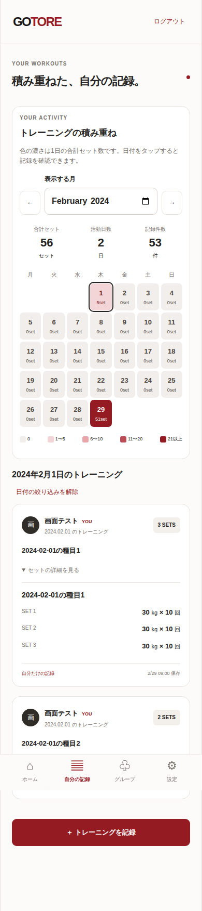

# 活動ヒートマップと日別記録（#14）

画面文言は2026-09-08の[簡略化方針](ui-copy.md)を優先する。説明は初回ガイドに集約し、以下の業務ルールを維持する。

実装Issue: [#35](https://github.com/ezofroger-in-hokudai/gotore/issues/35)、親Issue: [#14](https://github.com/ezofroger-in-hokudai/gotore/issues/14)、週次計画: [#33](https://github.com/ezofroger-in-hokudai/gotore/issues/33)。

2026-09-07の会話で、ユーザーが「ヒートマップ」「まずはセット数」「日付をタップしてその日のトレーニングを表示」を指定した。初版の本人記録一覧へ、以下を追加する。

## 2026-09-12のSCORE表示への変更

ユーザーの追加指定により、カレンダーの主指標をセット数から本人の基本配点によるSCOREへ変更する。同日の複数回は最高点を採用する。未評価・訂正前の得点は除外し、評価済み0点は有効値として扱う。記録があるのに評価済み点数がない日は「計測中」、未記録は「—」とし区別する。過去の未採点記録を0点で埋めない。

色はホーム・終了画面・履歴のバッジと共通で、未評価/未記録は無彩色、0〜49・50〜69・70〜84・85〜94・95〜100点の固定5段階。最高点が目立つ赤系の濃淡を使い、月間最大値に合わせて変えない。色だけでなく点数・日付を表示する。月の要約は最高SCORE・活動日数・記録件数。

`GET /api/workouts/activity?month=YYYY-MM` は `metric: "score"`、月の `best_score`、各 `days[].score`（数値またはnull）を返す。既存のセット数・記録件数も補助データとして保持する。

本人用の総合点は採点と同じトランザクションで保存し、日別最大値をDBで集計する。日付範囲と本人の索引で絞り、大きな採点根拠や履歴JSONを読み出さない。訂正中は旧点数を除外し、生成完了・削除後は次の読み取りへ反映する。表示中はバックグラウンド再確認してAI完了を反映する。

以下は従来のセット数版の経緯。日付選択・本人限定・エラー時の扱いは継続する。

## 表示と集計（セット数版の経緯）

- 「自分の記録」に月別カレンダーを表示。初期表示は日本時間の当月で、2000年1月から当月まで月を選べる。週は月曜始まり。未来日は操作不可とする。
- 記録日（performed_on）で集計し、保存日時や端末のタイムゾーンでは日付をずらさない。
- 対象月の本人の全記録を集計。個人記録も共有記録も含み、同じグループの他人の記録は含まない。表示ページの50件だけで集計しない。
- 1日の値は全種目のセット行数の合計。同日2記録で3セット・4セットなら7セット、記録2件・活動1日。重量・回数・種目名の表記揺れで補正しない。
- 色は表示用の固定5段階（0、1〜5、6〜10、11〜20、21以上）。月間最大値に合わせて変えず、別の月と比較できる。数値・日付・選択状態も示し、色だけに依存しない。
- 月の合計セット数、記録件数、活動日数を併記する。0件の月はすべて0。取得失敗は0件として描画せず、再試行を案内する。
- 現在はセット数であり、筋トレスコアとして表示しない。SCOREの式・採用は#13、継続日数・BEST・e1RM・種目別推移は#14の後続検討とする。

## 日付の選択

- 過去・当日のセルをタップすると、その日の本人の記録だけを一覧表示する。種目・重量・回数は既存の「セットの詳細を見る」で確認できる。
- 同日50件を超えても50件ずつページ送りできる。未記録日は「この日のトレーニング記録はありません」と案内する。
- 日付の絞り込みを解除すると従来の全記録一覧へ戻る。月・日付・画面を切り替えるとページを先頭へ戻し、前の日付の記録を表示し続けない。遅い応答で新しい選択を上書きしない。
- v2の履歴詳細から一覧へ戻る場合は、表示月と選択日を保持する。詳細で編集・削除した後も表示月を保持し、セット数・件数は再取得する。明示的な月変更では日付の絞り込みを解除する（#72）。
- 再取得時は再取得中・失敗を明示する。記録保存後や「自分の記録」を開き直した時に再集計する。

## APIとデータ

| メソッド・パス | 内容 |
| --- | --- |
| GET /api/workouts/activity?month=YYYY-MM | 本人の日別セット数と月合計。metricはsets。daysは記録のある日だけ |
| GET /api/workouts?performed_on=YYYY-MM-DD&limit=50&offset=0 | 本人の指定日の記録。日付省略時の動作は従来通り |

認証必須、no-store。不正な月・日付、2000年以前・未来の月/日は422。未認証401、設定不足・基盤障害503。ユーザーIDを受け取らず、Authで検証した本人を使う。共有グループの一覧APIは変更しない。

既存workoutsのuser_idとperformed_onの索引で対象を絞り、DBで全件を日別集計してAPIが月合計を返す。集計結果を別保存しないため、将来の編集・削除後も次回取得で最新記録から算出する。新しいDBテーブル・migration・依存は不要。採点方式の変更は別途API仕様と合意範囲を確認する。

## 検証例

- 月初・月末・うるう日・年越し・日本時間の日付境界。
- 同日複数記録、複数種目、0kgのセット、50件超、他人の個人/共有記録の除外。
- 空月・未記録日、本人限定、日別ページング、絞り込み解除、遅延・失敗後の再試行。
- DB内のテスト用記録を変更/削除して再集計結果を確認。編集/削除機能の追加は含まない。
- make check、make test-e2e、390px表示とキーボード操作を検証する。

## 画面例

390px幅・ブラウザテスト用データ。月の集計と、日付を選択した記録の表示例。

