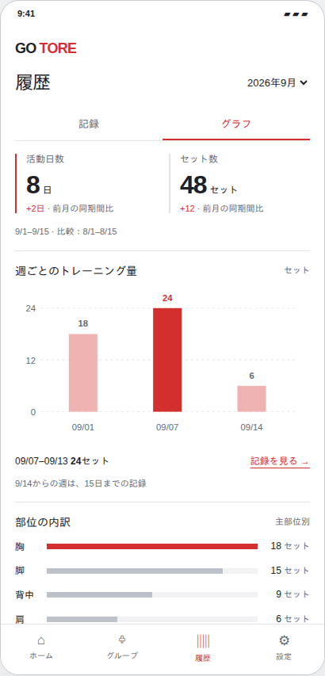
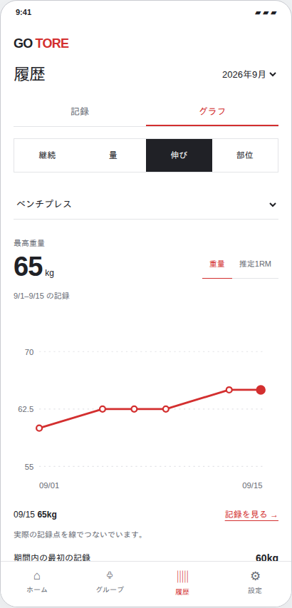
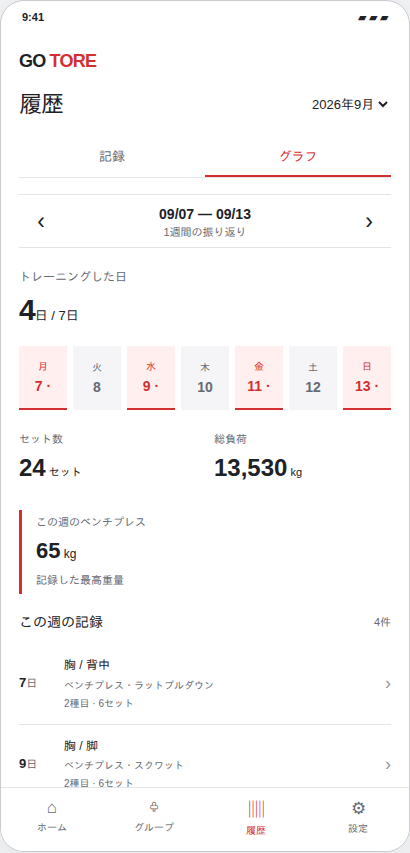

# グラフの見せ方：採用前の比較案

ユーザー依頼（2026-09-15）。**提案用のプレビューであり、アプリへの追加実装は未実施。**

[操作プレビュー](previews/analytics-options.html) / [3案の比較画像](images/analytics-options/comparison.png)

| 案 | 狙い | 操作 | 向いている使い方 |
| --- | --- | --- | --- |
| A 一覧 | 活動日数・セット数・週の量・部位を一画面にまとめる | 週の棒から記録詳細へ、月切替 | 開くたびに全体をさっと把握 |
| B 目的別（推奨） | 継続・量・伸び・部位を分け、必要なグラフを大きくする | 4タブ、種目、重量/推定1RM、セット数/総負荷、日付や点から記録へ | 指標の意味に沿って変化を確認 |
| C 週の振り返り | 曜日とその日の記録をつなげ、週の内容を振り返る | 前後の週、曜日、個別記録 | 日々の習慣と実際のトレーニング内容を確認 |

おすすめはB。指標によって使える粒度や描画を変えることを画面構成で表す。Aの上部要約、Cの週間表示を部分採用する選択も可能。

## 使うデータと読み込み

- `/analytics` の `totals` / `previous_totals` / `series`：セット数、日数、総負荷、日/週/月の最高重量・推定1RM。
- `/workouts/activity?month=…` の日別活動と主部位別 `set_count`：カレンダーと部位別の横棒。補助部位を加算した量や筋力評価ではない。
- `/workouts?date_from=…&date_to=…`：選んだ期間の記録の重量・回数・セット。Cの記録一覧も選択週だけ。初回から全履歴を取得しない。
- 種目の伸びは1種目ずつ。点は記録がある日だけで、日付間隔に応じた横位置。補間値を実績として出さない。
- 9月の要約は9/1〜9/15と、8/1〜8/15を比較。進行中の週には15日までであることを表示する。
- A/B/Cの初期状態は同じ架空の8日・48セット。9月と8月の切替、記録なしも試せる。実アカウント・API通信・保存なし。

## 画像

| A 一覧 | B 目的別 | C 週の振り返り |
| --- | --- | --- |
|  |  |  |

Bの別表示：[継続](images/analytics-options/B-habit.png)、[量](images/analytics-options/B-amount.png)、[部位](images/analytics-options/B-parts.png)、[記録なし](images/analytics-options/B-empty.png)。

## 確認結果

Chromiumで3案・Bの4タブ・種目/指標/月/週切替・詳細の開閉・キーボードによる点選択・記録なしを確認。320/390/430pxで横はみ出しなし、JavaScriptエラーなし。新しいライブラリや環境設定は不要。実機での操作感は採用案の実装時に確認する。
