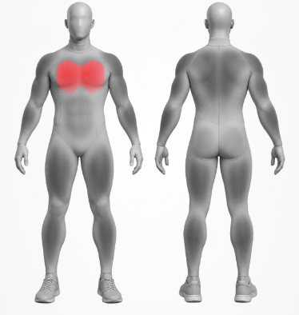
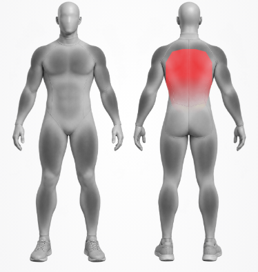
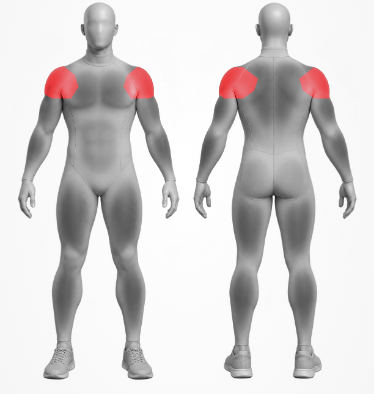
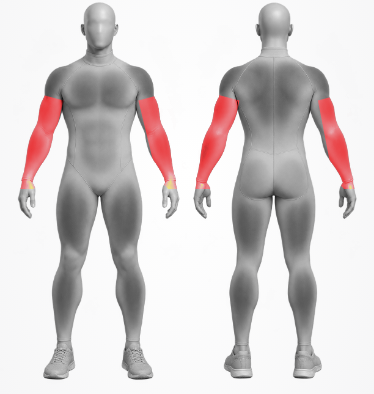
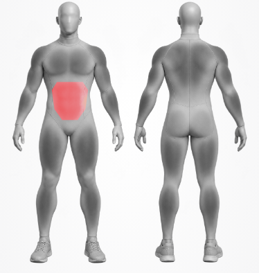
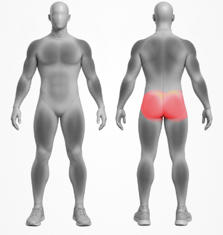
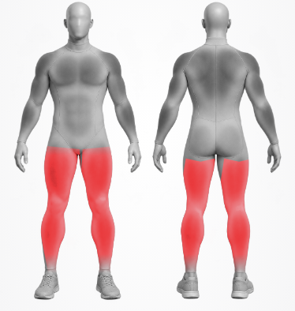

# 履歴画面の設計検討

2026-09-28の依頼に基づく個人履歴の設計記録。A「積み重ね」を起点に絞り込み、現在は[Cの固定プレビュー](../../frontend/public/previews/history-section-no-scroll-adopted.html)を採用して実装した。本人の通算値、月間カレンダー、推移グラフ、最近使った部位を3タブで振り返る。集計ルールは [履歴グラフ](../history-analytics.md) と [活動ヒートマップ](../activity-heatmap.md) を基準にする。

## 比較プレビュー

[履歴画面の方向性3案](../../frontend/public/previews/history-direction-options.html)は390px基準の架空データ。上部で案を切り替え、ヒートマップの日付、成長の種目、記録行を操作できる。実アプリ・API・保存値は変更しない。

| 案 | 最初に見せるもの | 意図 |
| --- | --- | --- |
| A 積み重ね | 通算の活動日数・記録回数・セット数・総負荷 | 頑張りの全体像から、日々の分布と種目別の成長へ進む基本形 |
| B 成長を主役 | 種目別の最高重量の推移 | 自分の変化を先に示し、通算と活動日を補助にする |
| C 活動を主役 | 直近13週間の活動と記録上の節目 | 休息日も含む歩みを見せ、数値の比較を後に置く |

## A案の絞り込み

ユーザーはAの積み重ねを基本方向に選択。初版プレビューは比較資料として残し、[情報を絞ったA案](../../frontend/public/previews/history-accumulation-refined.html)で次を比較する。これは画面の最終採用版ではない。

- 上部は開始から現在までの総負荷kg、トレーニング回数、セット数の累計に絞る。活動日数はヒートマップと重なるので外し、月間の一言・月間総負荷も外す。
- 「最近の記録」一覧は置かない。ヒートマップの日付からその日の記録を開く導線を残す。
- グラフは全種目／個別種目を切り替え、総負荷・最大重量・最大推定1RMを見られるようにする。新プレビューは、全種目の総負荷を各期間の全セットの合計、全種目の重量/RMをその期間のどれか1セットの最大値として例示する。異種目の最大値を足し合わせない。最大値には該当種目名を添え、種目構成の変化を「同一種目の成長」と誤読させない。
- 現行APIは全種目の重量/RMを返さず、種目指定を要求する。新プレビューの全種目最大値は実装済み仕様ではない。採用後に集計・API・テストの変更範囲を確定する。

## 種目が多い場合・週表示・日別全メニュー

2026-09-28、ユーザーは少数候補のドロップダウンでは種目増加時に探しにくいと指摘し、週ごとのグラフと、ヒートマップの日付からその日の全メニューを見たいと指定した。[操作を比較する3案](../../frontend/public/previews/history-exercise-week-options.html)を追加する。A/B/Cの基本はすべて上記の積み重ね案で、種目を探す方法と日別詳細の開き方だけを比較する。まだ採用案はない。

| 案 | 種目の探し方 | 日付を押した後 |
| --- | --- | --- |
| A 検索シート | 全種目を先頭に固定し、最近の種目と名前検索から選ぶ | ヒートマップ直下へ全トレーニング・全種目・全セットを展開 |
| B 一覧ページ | 名前検索と部位フィルターで長いリストを探す | 独立した詳細面にその日の全メニューを表示 |
| C 最近＋検索 | 全種目と最近の2種目を即切替し、それ以外は検索 | 下から開く詳細にその日の全メニューを表示 |

- 3案ともグラフの「週ごと／月ごと」を切り替える。週は月曜始まりで、総負荷はその週の合計、最大重量/RMはその週の実測最高値とする。週別の0と未記録の重量/RMは混同しない。プレビューは直近6週／6か月の架空データ。
- 日付に複数回のトレーニングがある場合も、その日付の全記録をトレーニング単位に分けて表示し、各種目の重量・回数をセットごとに省略せず見せる。本人の編集・コピー等の既存権限は後続実装でも維持する。
- この比較で決めるのは画面の導線。種目検索と全種目の最大重量/RMの実API対応、日別取得件数とページング、既存の月別カレンダーとの統合は実装前に確定する。

## 共通の表示範囲と操作量の整理

2026-09-28、ユーザーは「週/月と指標の両方をタブで選ぶと煩雑」「ヒートマップも種目ごとにしたい」「部位単位でも見たい」と指定した。これを受け、[共通の表示範囲2案](../../frontend/public/previews/history-shared-scope-options.html)を比較する。前節の3案は経緯として残すが、タブを二段に積む操作と、グラフだけの種目選択は新しい案へ戻さない。

- 画面上部で1つの表示範囲を選ぶ。全種目、本人の現在の主部位単位、個別種目のいずれかとし、ヒートマップとグラフへ同時に反映する。通算の上部要約だけは選択に連動しない全種目・全期間の値と明記する。
- Aは部位の合計を直接選べる8枠と、部位見出しでまとめた種目一覧。グラフでは期間を小さい選択欄、指標だけを切替ボタンとする。
- Bは横スクロールしない一列の8部位から種目を絞り、部位全体または種目を選ぶ。同じ部位を再度押すと種目の絞り込みを解除する。グラフでは期間・指標を各1つの選択欄にし、切替ボタンを並べない。
- 日付を押した後の全メニューは現在の表示範囲で隠さない。同日に複数回あればすべてのトレーニング、種目、重量・回数・セットを表示する。
- 部位の合計は既存の部位ヒートマップと同じく本人の現在の主部位で計上し、補助部位には二重計上しない。部位や種目を切り替えたとき、ヒートマップの色基準とグラフの値を同じ対象で更新する。0kgの記録と未記録は実装時に区別する。
- この段階は操作プレビューで、種目別の日別集計、部位別グラフ、全種目／部位の最大重量・推定1RMは現行APIにない。採用後に必要なAPI・キャッシュ・テストを確定する。

## 少数の選択肢はタブで見せる

2026-09-28、ユーザーは週／月と総負荷・最大重量・最大推定1RMのように選択肢が少ないものは、プルダウンよりタブを希望した。ただし期間と指標を同じ強さの二段タブで並べる案は採用せず、[タブの配置を比べる3案](../../frontend/public/previews/history-graph-tabs-options.html)で比較する。表示範囲は前節と同じくヒートマップ・グラフ共通で、全種目・主部位・個別種目から選ぶ。

| 案 | 週／月 | 指標 | 比較する点 |
| --- | --- | --- | --- |
| A 右上に期間 | グラフ見出しの右の小さいタブ | グラフ上部の横長タブ | 指標を主操作にしつつ、期間も常時見える |
| B 指標を主役 | 数値とグラフの間の小さいタブ | グラフ上部の横長タブ | 数値の意味と表示単位を分けて見せる |
| C 1列で選ぶ | グラフ上部の左2枠 | 同じ行の右3枠。重量・1RMは短縮表記 | 縦の占有を抑えた一列操作 |

- 3案ともプルダウンを使わず、期間・指標の切替を即時に反映する。ユーザーはBを基本形に選択した。A・Cは比較の経緯として残す。
- 種目が多い選択だけは検索シートに残し、部位の合計を直接選ぶか、部位見出しから個別種目を探す。日付詳細は選択中の範囲にかかわらず全メニュー・全セットを示す。

## B案の過去への移動と部位選択

[スワイプ対応のB案](../../frontend/public/previews/history-swipe-b.html)で、選択されたBを調整する。週／月、総負荷・最大重量・最大推定1RMは引き続きタブで選び、同じ表示範囲がヒートマップとグラフへ反映される。

- この段階の試作ではグラフ端に次の棒を少し見せたが、後の採用プレビューでは紛らわしいため除外した。横スワイプと過去／新しい期間の補助ボタンは維持する。右方向のスワイプで過去へ、左方向で新しい期間へ移動する。月は3か月、週は6週を基本の表示窓とし、最古の窓は記録開始月／週で切る。先に記録がない期間を無限に出し続ける意味ではない。
- 種目の検索シートでは、既存の種目選択画面と同じ8部位一列の薄いトラック・白い選択面を使う。部位選択で種目一覧を絞り、部位全体を見る操作と個別種目の操作を分ける。これはプレビュー上のデザイン再利用であり、まだ実部品の共有実装はしていない。
- 日別全メニューのトレーニング見出しは「朝」「夜」を付けず、開始時刻だけを表示する。

## 全期間・日別部位・人体図の試作

2026-09-28、ユーザーはB案の継続として、滑らかな記録推移、全期間、日付1タップのメニュー、日別に使った部位、直近3日で使った部位の人体図を希望した。[操作可能な試作](../../frontend/public/previews/history-b-growth-body.html)で確認する。現行画面への採用・実装はまだ行っていない。

- 週・月の横送りは指の移動に追随し、切替後は短くスライド／フェードする。全期間は開始月からの月別の点を滑らかな線で結ぶ。動きを減らす端末設定ではアニメーションを止める。
- この試作では全期間の総負荷を開始からの累計、最大重量・推定1RMをその時点までの最高値として例示した。実機で同じ月の数値が月タブと異なり紛らわしいと分かったため、この集計方法は後述の実装調整で取りやめた。
- ヒートマップの日付を1回押すと、その日の部位・全トレーニング・全種目・全セットを直接開く。現在の表示範囲に関係なく日別の全記録を見せ、時刻は24時間表記だけにする。
- 「最近使った部位」の人体図はチャレンジ枠。プレビューでは9/26–9/28の記録にある主部位を前後の図で着色する。「疲労」を実測した結果として扱わない。当初の画面上の説明文は後の採用案で削除した。補助部位を含めるか、部位が記録された時刻とタイムゾーンは未確定。
- 追加指定により、ヒートマップ下の「日付をタップして部位と全メニューを見る」という操作説明は表示しない。1タップで開く操作自体は維持する。人体図は棒状の見本から、前後のシルエットと肩・胸・腕・腹・脚・背中・お尻の区分が分かる図へ改めた。人体図の形は引き続き比較中。

### 人体図のリアリティを比較

さらに人体図を模型らしくした[3案の比較プレビュー](../../frontend/public/previews/history-body-realism-options.html)を用意した。履歴画面の通算、ヒートマップ、日別全メニュー、グラフはB案のままで、人体図だけを切り替える。まだ採用案はない。

| 案 | 人体図 | 比較する点 |
| --- | --- | --- |
| A 筋肉模型 | 明るい面に前後2体の筋肉分割を細かく描く | 部位の読み取りやすさ |
| B 立体モデル | 暗い面に陰影付きの前後2体を置く | 模型らしい立体感と画面の雰囲気 |
| C 大きく見る | 前または後を大きく表示し、タブで入れ替える | 細部の見やすさと前後切替の手間 |

- 3案とも同じ架空の履歴を使い、9/28時点で1日前の使用部位は濃い赤、2日前は中間、3日前は淡い赤のグラデーションとする。部位ラベルの点と凡例も同じ濃淡に揃える。これは経過日の可視化であり、筋肉疲労の測定値ではない。
- プレビューでは9/27の胸・背中・脚・腕・肩、9/26の腹筋、9/25のお尻を例示する。複数日に同じ部位を使った場合は最後に使った日で色を決める。実装時のタイムゾーンと「3日以内」の境界は別途確定する。

### 人体図をかわいくした比較

ユーザーの「もっとかわいく」に対して作成した[人体図の比較プレビュー](../../frontend/public/previews/history-body-cute-options.html)を、その後の「もっとリアル」に合わせて更新した。顔・ステッカー・ちび模型のデフォルメは却下し、人体図の印象と表示スケールだけを比較した。履歴画面の情報と操作はB案のまま。

| 案 | 人体図 | 比較する点 |
| --- | --- | --- |
| A 柔らかい解剖図 | 自然な頭身のSVG人体図を温かい色で前後2体 | 部位の境界を明確に読めるか |
| B 立体ヒートマップ | 全身スーツの写実モデルを前後2体 | 自然な人体の質感と一目での分かりやすさ |
| C 大きく見る | Bの写実モデルを1体拡大し、前後を切り替える | 細部とカードの縦幅の釣り合い |

- 直近1/2/3日前の赤の濃淡と、記録した主部位だけを示すことを維持する。
- B/Cの[画像素材](../../frontend/public/previews/history-body-realistic-heatmap.png)は比較用の固定サンプル。画面上の架空記録に合わせた1/2/3日前の色分けであり、実記録から各部位の色を生成する実装ではない。採用後はデータに応じて部位ごとに着色できる素材・手段を別途決める。
- これは比較用の静的プレビューで、実画面・API・集計仕様には反映していない。

### 採用した人体図

[立体ヒートマップの採用プレビュー](../../frontend/public/previews/history-body-heatmap-adopted.html)を実装・画面確認の基準とする。B案の前後2体を同時に表示し、C案の前後切替やA案のSVG解剖図へ戻さない。

- カードには「最近使った部位」「直近3日」、前／後、1日前から3日前の色の凡例、部位と経過日を表示する。
- 下部の「9/25–9/28の記録の主部位から表示。疲労の測定ではありません。」は表示しない。ここで示す赤の強さは最後にその部位を記録してからの経過日であり、疲労量として扱わない。
- 固定の画像素材をそのまま本番データへ当てはめない。採用プレビューと同じ立体的な見た目を保ちながら、部位ごとに実記録へ応じて着色する方法は実装前に決める。

### 種目選択の再比較と表示の整理

現行の検索シートが事務的で手数も多いという指摘を受け、[種目選択の操作可能な3案](../../frontend/public/previews/history-exercise-picker-options.html)を比較した。その後、ユーザーは種目選択画面と同じように部位タブから選ぶ方針を指定したため、この3案の入口は採用しない。履歴B案の他の要素と採用した立体ヒートマップは変えない。

| 案 | 入口 | 選び方 |
| --- | --- | --- |
| A 最近から | 全種目・最近の種目・探すを直接表示 | 最近の種目は1タップ。探すときは検索・部位・全一覧を開く |
| B 検索から | 選択中の範囲を一行で表示 | 開いたシートに全種目・最近の種目・検索・部位を置き、全一覧は検索／部位選択後に表示 |
| C 部位から | 部位・種目の入口を一行で表示 | シートの縦レールで部位を選び、右側で部位全体または種目を選ぶ |

- 3案とも全種目・主部位全体・個別種目を選択でき、ヒートマップとグラフを同時に切り替える。通算値は全種目・全期間のまま。日付から開く全メニューは選択範囲で削らない。
- 「2025年11月から」は不要として表示しない。グラフ端の予告用の棒も紛らわしいため表示しない。グラフのスワイプと「過去／新しい」ボタンは維持する。
- 比較は静的プレビューのみ。実アプリの種目選択や集計APIはまだ変更しない。

### 部位タブを起点にする3案

[部位タブから選ぶ比較プレビュー](../../frontend/public/previews/history-part-tabs-options.html)を追加。種目選択画面と同じ8部位の一列・8等分・薄いトラックと白い選択面を使う。部位タブを1回押すと、ヒートマップとグラフをその主部位全体へ即時に切り替える。個別種目を選んだ後も該当部位のタブを選択状態にする。その後、ユーザーは部位タブの下に種目の二段目のタブを出す方針を希望したため、この3案の部位タブ下の見せ方は採用しない。

| 案 | 部位タブの下 | 個別種目への進み方 |
| --- | --- | --- |
| A コンパクト | よく使う種目を2列の短いボタンで表示 | 見えている候補は直接、他は検索シート |
| B 一覧を直置き | よく使う種目を短い縦リストで表示 | 見えている候補は直接、他は検索シート |
| C タブ優先 | 「種目を選ぶ」の一行だけ | 部位で絞られた検索シートを開く |

- 画面上部の「MY HISTORY」「自分の積み重ね」は画面を見れば分かるため表示しない。以前の「2025年11月から」の非表示も維持する。黒い共通ヘッダーの直下から通算値を見せる。
- 3案とも通算値は全種目・全期間で固定。部位や種目の選択はヒートマップとグラフに共通し、日付から開く全メニューは絞り込まない。
- 種目選択画面の複数部位同時選択は履歴に持ち込まない。履歴の表示範囲は「全種目／主部位1つ／個別種目1つ」のいずれかにして集計の意味を一意にする。

### 部位を押した後に種目タブを出す3案

[二段タブの比較プレビュー](../../frontend/public/previews/history-two-level-tabs-options.html)で、上段に「すべて」と8部位を同じ一列のタブで並べる。下段は初期表示から常に確保し、「すべて」では「全種目＋種目」、部位選択時には「部位全体＋その部位の種目」を表示する。下段は各案で固定の高さを持ち、範囲を切り替えても下のコンテンツが上下に動かない。個別種目を押しても上段の該当部位の選択を保つ。部位を押し直すと、個別種目選択中は部位全体へ戻り、部位全体選択中は全種目へ戻る。「すべて」はいつでも全種目へ戻す。ユーザーはAを採用し、B/Cは採用しない。

| 案 | 二段目の表示 | 種目が多いとき |
| --- | --- | --- |
| A 横に流す | 一列のタブを横へ送る | 高さを増やさず全種目を並べる |
| B 折り返す | 全種目／部位全体と最大3件の種目・「探す」を固定2行で表示 | 残りは「探す」から検索シートへ進む |
| C 探すを固定 | 部位全体・2件の種目・検索を一列に固定 | 検索入口の位置を動かさず他の種目を探す |

- 3案とも部位・種目の切替をヒートマップとグラフへ同時に反映する。通算値と日付を押したときの全メニューは絞り込まない。
- 検索シートは選択中の部位で候補を絞る。シートから選んだ種目が二段目の短い候補から外れていても、選択中のタブとして見せる。
- これは操作の静的プレビューで、実アプリ・APIは未変更。横へ送るAの発見しやすさ、折り返すBの高さ、Cの少数候補で足りるかを比較する。

### 採用した横スクロールの二段タブ

[採用プレビュー](../../frontend/public/previews/history-two-level-tabs-adopted.html)を履歴の表示範囲選択の基準とする。比較用Aと同じく、上段の「すべて」と8部位、常時表示の下段、横スクロールできる1行の種目タブを維持する。Bの折り返しやCの候補数制限は採用しない。

- 下段は全種目／部位全体を先頭に固定し、その後の種目を最後に本人がトレーニングした日時の新しい順に並べる。同一トレーニング内など日時が同じ種目は既存の種目リスト順、未記録の種目は記録済みの後ろに置く。「すべて」では全種目、部位選択中はその主部位の種目を対象にする。
- 選択した個別種目が横に隠れている場合は、再表示時にそのタブが見える位置まで横スクロールする。上段と下段の高さは切替で変えない。
- この並び順はプレビュー内の記録例から計算している。実アプリの履歴集計・種目選択は未変更。実装時は保存済み記録の日時を使い、現在のAPIで取得できるか確認する。

### カレンダーとグラフを比較中

[カレンダー×グラフの3案](../../frontend/public/previews/history-calendar-graph-options.html)を、採用済みの通算カード・二段タブ・立体ヒートマップを変えずに比較した。ユーザーはBを採用し、A/Cは採用しない。

| 案 | カレンダー | グラフ | 比較する点 |
| --- | --- | --- | --- |
| A 足あとを磨く | 13週間のコンパクトなヒートマップ | 白いカードの棒／推移線を整理 | 現在案の一覧性と画面の短さ |
| B 月を読む | 日付と日別総負荷を示す月間カレンダー | 赤い面を伴う滑らかな推移線 | 特定の日・量を探しやすいか |
| C 週のリズム | 13週を1行ずつ、7日と週合計で表示 | 暗色のグラフカード | 活動のリズムと週合計を読みやすいか |

- 3案とも上の「すべて／部位／種目」にカレンダーとグラフの両方が連動する。日付を押すと選択範囲で削らない全メニュー・全セットを表示する。Bは月を前後に送れる。
- 週・月・全期間、総負荷・最大重量・最大推定1RM、グラフの点選択、過去へのスワイプを維持する。比較中のA/Cには補助ボタンがあるが、採用したBでは外す。欠測の重量・RMを0に置き換えず、全期間の総負荷は累計とする。
- 0kgの記録日と未記録日は区別する。Bの日別小表示だけ1,000kg以上を`k`で短縮するが、読み上げには省略しないkg値を使う。Cは縦幅が大きくなる案として比較し、以前に外した「日付を押して全メニューを見る」という説明文は戻さない。
- この比較は静的プレビュー。実アプリ・API・DBは未変更。既存の月別カレンダーと長期ヒートマップをどのように統合するかは採用後に決める。

### 採用した月間カレンダーと推移線

[固定したB案](../../frontend/public/previews/history-calendar-graph-adopted.html)を履歴のカレンダー・グラフの基準とする。月間カレンダーの前後ボタンは置かず、右スワイプで前月、左スワイプで新しい月へ移る。月が指に追従してから短くスライドする。グラフも同じ方向のスワイプを維持し、「過去へ／新しく」の補助ボタンは置かない。指標と週／月／全期間のタブ、点選択は残す。

- カレンダーの高さは常に6週分とし、隣月の日付を薄く示すが、その日付は押せない。月送りで下のグラフが上下しないようにする。記録開始月より前と現在月より先には進まない。プレビューは2025年11月〜2026年9月の架空データ。実装では本人の記録開始月と現在月を使う。
- カレンダーはキーボードの左右矢印でも月を切り替える。日付を押すと表示範囲にかかわらず、その日の全記録・全セットを開く。月の6週表示とスワイプの間、0kg記録日・未記録日・未来日を混同しない。
- グラフは週／月の過去へ横スワイプで進む。全期間には過去送りを適用しない。計算済みの総負荷・重量・推定1RMの意味、欠測の扱い、通算との区別を変えない。
- 実アプリ・API・DBは未変更。既存の月別カレンダー／グラフの実装との統合と、立体人体図の実記録による着色は後続実装で扱う。

### 採用B案の仕上げを再比較

[仕上げの3案](../../frontend/public/previews/history-calendar-graph-refinement-options.html)は、上記の採用プレビューを共通の土台にして、月とグラフの連動範囲・初期の推移期間だけを比較する。ユーザーは月グラフの6か月表示を選んだ。月とグラフを相互連動させるかは未選択。

| 案 | 月とグラフ | 月グラフ | 比較する点 |
| --- | --- | --- | --- |
| A このまま | カレンダーの月とグラフの期間・点を独立して操作 | 直近3か月 | 採用版の軽さを維持する |
| B 月を連動 | カレンダーの月送りが月グラフの該当点を選ぶ。月／全期間グラフの点から該当月のカレンダーへ移る | 直近3か月 | 別々の月を見ている混乱を減らせるか |
| C 6か月推移 | Aと同じ独立操作 | 直近6か月 | 成長の変化を一度に読みやすいか |

- Bの月グラフを横に送ると、新しい表示窓の最後の月へカレンダーも移る。週グラフのスワイプはカレンダーを強制移動しない。全期間グラフの点を押して現在月へ戻る操作も試せるが、通常の「今月へ戻る」導線として足りるかは未決定。新たな常設ボタンは付けない。
- Cの月グラフは6か月単位で横スワイプし、最古は記録開始月で止める。週／全期間、指標の意味、日付から開く全メニュー、0kgと未記録の区別は3案とも変えない。
- 比較は架空データの静的プレビューのみ。実アプリ・API・DBは未変更。

### 採用した6か月の月グラフ

[6か月表示の固定プレビュー](../../frontend/public/previews/history-six-month-graph-adopted.html)を現在の画面照合基準とする。カレンダーの見た目・横スワイプ、グラフの見た目・週／月／全期間タブは維持し、月グラフの初期表示と横スワイプ単位だけを3か月から6か月に変更する。グラフに前後ボタンは戻さない。

- 初期表示は直近6か月。過去へ横スワイプすると前の6か月を表示し、記録開始月を越えない。過去の窓が6か月未満になる場合は存在する月だけ示し、値のない月を0として捏造しない。週と全期間の表示は従来どおり。
- この固定プレビューでは比較案Cと同じくカレンダー月とグラフの点を独立して動かす。ただしユーザーが確定したのは「6か月」という窓幅だけで、相互連動の採否は保留。相互連動しないことを最終仕様とみなさない。
- 実アプリ・API・DBは未変更。実記録接続時に集計範囲、画面遷移、既存の月別カレンダーとの統合を確認する。

### セクションのタブ切替と画面内レイアウト

[セクション切替の2案](../../frontend/public/previews/history-section-tabs-options.html)から、カレンダー／グラフ／使った部位を独立させるAの3タブを採用した。Bの2タブと、カレンダー下まで縦スクロールして人体図を見る配置は採用しない。

| 案 | タブ | 人体図の位置 | 比較する点 |
| --- | --- | --- | --- |
| A 3タブ | カレンダー／グラフ／使った部位 | 独立したタブ | 各セクションへ1タップで届くか |
| B 2タブ | カレンダー／グラフ | カレンダーの下 | タブ数を減らした軽さと、人体図までのスクロール量 |

- 通算値と「すべて／部位／種目」の選択はタブの上で共通。セクションを切り替えても選択した月、週／月／全期間、指標、グラフの点、部位・種目を保持する。日付から開く全メニューも従来どおり。
- セクションはタブのタップまたはキーボードの左右矢印で切り替える。画面全体の横スワイプはセクション切替に使わない。月間カレンダーとグラフの横スワイプが衝突しないようにする。
- [画面内で完結する3案](../../frontend/public/previews/history-section-no-scroll-options.html)から、Cの3数値バーを採用した。Aの圧縮黒カードとBの横長サマリーには戻さない。[Cの固定プレビュー](../../frontend/public/previews/history-section-no-scroll-adopted.html)を今後の照合基準とする。
- Cでは比較用の帯を取り除いて端末の高さを画面に使い、グラフの描画そのものを残りの領域へ拡大する。週／月／全期間、指標、6か月の滑らかな推移線、横スワイプは維持する。グラフの点が縦長にならないようにする。
- 3つのセクションはカードの上端をそろえる。「トレーニングの足あと」「記録の推移」「最近使った部位」と英語小見出しは、3タブと内容で識別できるため表示しない。カレンダーの年月、グラフの指標・期間、人体図の「直近3日」は操作・値の意味を示すので残す。余った高さはグラフと人体図に渡す。
- 人体図は左右に並ぶ前面・背面の形で判別できるため、図の「前」「後」ラベルも表示しない。アクセシビリティ用の画像説明では向きの情報を保持する。
- グラフ下の「重量 × 回数の合計。カレンダーと同じ表示範囲です」などの説明文は表示しない。選んだ指標・期間のタブと数値を残し、空いた高さはグラフに渡す。
- 初期表示はナビまでの一画面に収め、タブ下の表示領域を高さに合わせる。実機確認後、グラフを上へ引き上げて見やすくするため、画面全体の縦スクロールも許可した。月間カレンダーは6週固定、グラフ・人体図・部位と種目の切替を保持する。日別全メニューや種目検索のシートは長い内容をスクロールできる。
- この比較時点では静的プレビューのみ。月とグラフを相互連動させるかは、この比較とは別に保留した。画面の低い端末で日付のタッチ領域を確保する方法も実装時の確認項目とした。

## 実装と保留事項

- 最初は個人履歴のみ採用プレビューの構成へ切り替え、グループ履歴の既存構成を維持した。その後、実機確認によりグループのグラフも共通部品へ更新した。通算値は本人の保存済み記録全体で、部位・種目タブによる絞り込みの対象外。部位・種目の選択は個人のカレンダーとグラフに共通で、日付詳細は絞り込まず全メニューを開く。
- 本人の記録が端末に保存済みなら、通算値・月間カレンダー・日付詳細を先に表示し、従来のAPIで再確認する。別端末の変更を確認したら端末由来の表示を更新し、APIで確認済みの値を古い端末内容で巻き戻さない。グラフとグループ履歴は従来のAPI取得を続ける。詳細は[端末保存](../personal-device-storage-plan.md)を参照する。
- 個人の全種目・部位別集計でも最高重量と最高推定1RMを返す。種目間の値を合算せず、期間内の最大値とその元になった種目名を示す。種目は最後の記録日順に並べ、記録開始月より前へカレンダーを送らない。実機確認後、グラフの「月」と「全期間」は同じ各月の総負荷・セット数・最大重量・最大推定1RMを示し、表示密度と見渡す期間だけを変える。上部の通算値だけは本人の全記録の累計とする。
- 人体図はプレビューの写実素材を基礎画像としてグレースケール化し、直近0〜3日で記録した主部位だけ同素材の色を重ねる。赤の濃さは最後の記録からの経過日数であり、疲労の測定値ではない。補助部位は集計しない。
- 月とグラフの相互連動は未決定のため実装しない。既存の日別記録APIは1回最大50件だが、日付詳細は続きのページを自動取得して全件表示する。低い端末での日付タッチ領域の最終調整は実機確認で行う。

### 実機確認後の調整

- 人体図の赤は今日を最も濃く、1日前・2日前・3日前を明確に薄くする。3日前を今日と同じ赤に見せない。凡例と部位タグも同じ濃淡に合わせる。
- グラフは6か月／6週ごとの画面入れ替えではなく、表示外の過去も一本の線として連続させ、指に追従する横スクロールで移動する。初期位置は最新側で、月は約6か月／週は約6週が見える密度を維持する。全期間は同じ月別の数値をより詰めた密度で見渡し、必要なら横へ送る。
- 日付詳細はホームの記録カードと同じ `RecordList` のコンパクト表示を再利用する。シートの見出しに日付を置き、各カードは時刻と総負荷・全セットを示す。長いカードの展開操作も共通とする。

### 連続表示・配色・人体図の追加調整

- 履歴のカード、タブ、カレンダー、グラフ、種目選択シートは共通の明暗テーマ色を使う。黒い通算帯は採用済みのまま維持する。グループ内の共通グラフも同じテーマ色で描く。
- グラフは月・週の各点と縦目盛りを一本の横長い面に配置し、画面端で線を切り替えない。指や横ホイールの移動量に応じて面全体が連続移動する。上部の選択値はスクロール中に毎フレーム切り替えず、指が止まってから更新する。点のタップによる選択は残す。
- 人体図は元画像の色を狭い楕円で透過表示する方法をやめる。胸・背中・腕・脚などの主部位を広く切り出す。素材の陰影は残しつつ、使った部位の灰色の表面まで赤系に着色する。日数差は塗りの不透明度ではなく、彩度・明るさの4段階で示す。
- 追加の実機確認で日数差がまだ弱かったため、今日の赤をより濃く、3日前をほぼ無彩色の淡色まで離す。背中・おしり・脚の切り抜き境界は直線で横切らず、身体の輪郭に沿ってずらし、背中とおしりの上下端は自然に消えるようにする。
- 実機でグラフ上だけ縦スクロールできなかったため、グラフの横スワイプと履歴全体の縦スワイプを両立させる。人体図の切り抜き座標は、画像の実際の縦横比を持つレイヤーを基準にし、上下の余白を含む容器を基準にしない。おしりは左右の表面全体を塗る。
- 2026-09-29の実機確認で、肩が上腕へ広がり左右の範囲も揃っていなかったため、肩は上腕の上端より上の肩先だけに限定し、腕・脚・肩の左右の切り抜きを鏡写しの形で生成する。胸・背中も左右対称の輪郭へ整える。グラフ上の説明は期間の日付範囲と「期間」だけを残し、「表示単位」「期間の推移」「累計・最高値」は表示しない。

### 部位ごとの切り抜き確認

2026-09-29、各部位だけを今日使った状態で430px画面から撮影した。胸は左右の胸筋を別々に切り抜き、肩・上腕と腹筋へ広げない。背中は肩甲骨付近から腰までの胴体内に収め、肩・上腕へ広げない。腹筋は胸の下から骨盤の上まで、腕は手首より上までとする。左右の対になる部位は同じ形を鏡写しにする。画像は切り抜きの照合資料であり、着色は本人の記録と経過日数で変わる。

背中の切り抜きは、元画像の背骨の線を中心とする。最初の単独画像では赤い範囲が数ピクセル右へ寄っていたため、中心を合わせ直し、肩・上腕側へ広げずに撮り直した。

腕は肩先の直下から上腕二頭筋・三頭筋を覆う。最初の単独画像では肩の下に灰色の隙間があったため、腕の上端を斜めに上げ、肩先の形と手首より下の灰色は維持した。下の腕画像を2026-09-29に採用した。この境界を以後の実装・レビュー基準とする。

| 胸 | 背中 | 肩 | 腕 |
| --- | --- | --- | --- |
|  |  |  |  |

| 腹筋 | おしり | 脚 |
| --- | --- | --- |
|  |  |  |

## 守る条件と保留

- 個人履歴は本人の非共有記録も含む。グループ履歴とは混ぜない。
- 種目ごとの重量・推定1RMを異なる種目間で合算しない。総負荷は重量×回数の保存済みセットから計算し、0kgの記録日と未記録日は区別する。
- ヒートマップは日付から実際の記録へ進める。今回の長期表示は既存の月別カレンダーを置き換えると確定したものではない。

2026-09-29のグループ画面との照合で、個人履歴の月間カレンダーをグループ詳細でも共通部品として使うことにした。月送り、6週固定、色分け、日付から共通記録カードを開く操作を揃える。グループは主部位までの単一選択とし、その選択をグラフと共用する。個人の種目選択・通算帯・人体図はグループへ追加しない。

2026-09-29の実画面確認で、月間カレンダーの活動日がすべて同じ淡色になり、ヒートマップとして読めない問題を修正した。記録なしはグレー、0kgの記録日は最も薄い赤、正の総負荷は表示中の月・絞り込み範囲の最小〜最大を赤の4段階へ割り当てる。負荷が同じ日のみなら活動色の最高段階にする。明暗テーマとも赤の濃淡を明確にし、最高段階は白文字で読む。月をまたぐ絶対負荷の色比較ではなく、その月内の強弱を示す。隣月の日付は押せない薄い文字にする。
- 連続記録を義務のように見せず、休息日で過去の積み重ねが消える表現にしない。
- 現行の黒48pxヘッダー、浮遊するSTART/RESUME、下部ナビ、記録詳細の操作と共通部品を前提にする。
- 通算指標とカレンダー／グラフ／人体図の3タブは採用済み。比較案の節目や長期ヒートマップは追加しない。プレビューの数値は架空の表示例で、実画面は本人の保存済み記録から集計する。

2026-09-29、個人履歴の初期表示を端末の保存済み本人記録から行うことを追加で採用。通算・カレンダー・日付を開いた全メニュー・週/月グラフ・使った部位が対象。記録操作後も端末の先行表示を続け、サーバー照合は背景で行う。送信待ちのセットは既存キューで区別し、サーバー確定前に同期済みと扱わない。グループの記録・グラフは従来のAPIを使う。

## 部位内訳のない応答の扱い（2026-10-01）

カレンダーの応答に主部位の内訳がない日が含まれる場合、部位の合計を0件と推測しない。既存のグループカレンダーと同様に全種目の値を表示し、部位選択を無効にする。種目の選択とグラフの表示範囲は保持する。正常な内訳を受信したら元の部位範囲で表示する。

### グラフの更新失敗と再試行（#218）

取得済みの点がある更新失敗でも、グラフを保持しながら更新失敗と再試行を表示する。初回失敗では取得失敗を表示し、401/403/404では権限を失った点を消す。個人・グループとも `docs/history-analytics.md` の保持規則に従う。

### 人体図の未取得・失敗と月境界（#279）

- 「使った部位」は、直近3日を含む当月・必要な前月の両方の取得状態を扱う。一方が未取得/保留なら、確認済みの空データとみなさない。
- 初回失敗では人体図のタブ内に取得失敗と「再試行」を表示し、「最近の記録はありません」と断定しない。正常な必要月の応答で対象部位がない場合に限って空表示を出す。
- 更新失敗では取得済みの部位表示を保持して、前回内容の表示と再試行を示す。再試行は失敗/未取得の月だけを対象とし、タブ往復を要求しない。正常取得済みの月を再度待たせない。
- 人体図・3タブの採用レイアウトは維持し、通常の操作説明を増やさない。

修正後の取得失敗: [390px・ライト](../images/audit-fixes/body-failure-after.png)（調査用データ、snapshot/活動GETを503で再現）。

### 全体メモの保存待ち（#174）

本人の日別全メニューにある既存の「メモ」は保存ボタンを維持する。端末受付後は編集欄を閉じ、記録の閲覧・コピー・編集等へ戻れる。送信中もメモを開き直して次の編集ができ、失敗・競合は本文を復元して示す。今日の種目メモとの保存先の統合や、新しい履歴配置はこの変更では行わない。[本人メモ](../private-workout-memo.md#保存の受付と画面移動174)と[前後画像](../images/memo-delivery/README.md)を参照する。
