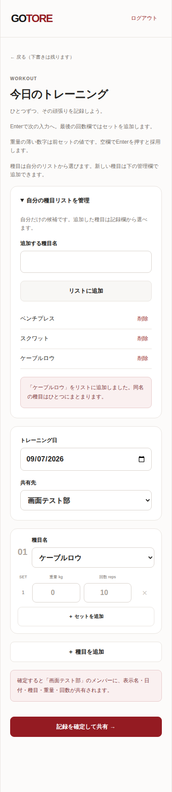

# 本人用の種目リスト（#28）

2026-09-07のユーザー依頼に基づく追加仕様。初版の自由入力を、自分で管理する候補からの選択へ変更する。

## 利用者の操作

- 記録画面の「自分の種目リスト」で候補を追加・削除し、各種目欄で選択する。リストは本人専用で、同じアカウントの別端末でも利用できる。
- 初回だけ既存の8候補（ベンチプレス、スクワット、デッドリフト、ペックフライ、ラットプルダウン、ショルダープレス、懸垂、腕立て伏せ）を用意する。すべて削除しても勝手に復活させない。
- 名前は前後空白を除き1〜60文字。同じ名前の再追加・再送は同一候補を返す。前後空白以外の表記揺れは統合しない。
- リストの削除と記録からの種目行削除を区別する。リスト削除は対象名と履歴が残ることを確認してから行う。
- 追加・削除の失敗時は入力とリストを保持して再試行できる。取得失敗を空リストとして扱わない。

## 記録・共有との境界

- リストは他人に公開しない。本人が記録に使い、グループへ確定共有した種目名だけが従来通り公開される。
- 保存済み記録は従来通り名前・重量・回数のスナップショットとし、候補への外部キーは付けない。候補削除で記録を削除・変更しない。
- 下書きの種目名は保持する。候補にない既存名は「下書きの種目」として選択欄へ残し、変更・保存ができる。記録APIは既存クライアント・再送との互換性のため既存の名前制約を維持する。
- 20種目・30セットの上限、入力制約、共有先、保存UUIDの再送ルールは初版と同じ。
- 複数種目を一括で呼び出すメニュープリセット、前回値・BEST・目標は[#17](https://github.com/ezofroger-in-hokudai/gotore/issues/17)で別途扱う。

## API・DB

| メソッド・パス | 内容 |
| --- | --- |
| GET /api/exercise-options | 本人の候補を取得。初回のみ既定候補を作成 |
| POST /api/exercise-options | nameだけを受け、本人の候補を追加。重複は同一候補を返す |
| DELETE /api/exercise-options/{id} | 本人の候補だけ削除。成功204、他人・不明IDは404 |

認証必須、入力不正422、未認証401、基盤障害503、応答no-store。所有者は検証済みAuthから決め、本文のuser_id等は拒否する。

gotore_exercise_catalogsで初期化済みの本人を保持し、gotore_exercise_optionsへ候補を保存する。初期化は1トランザクションで行い、並行アクセスでも二重作成しない。候補は本人と名前の一意制約、名前長のCHECK、所有者への外部キー、RLSを持つ。ブラウザのDB直接アクセスは許可しない。

追加migrationをアプリの公開前に適用する。既存記録の書換え・削除はない。初期化・追加・削除をFastAPI側で行い、将来のモバイルも同じAPIを利用できる。

## 受け入れ検証

- 初回・繰り返し取得・追加・重複・全削除後の再取得、空白・60/61文字、所有者偽装、他人の削除拒否、RLS。
- 候補削除後の本人とグループの過去記録、既存下書きの復元、記録保存失敗後の再送。
- 390px幅で選択・管理・失敗復帰を確認し、make checkとmake test-e2eを実行する。

## 画面例

390px幅のブラウザ検証用データによる画面。実ユーザーの情報は含まない。

