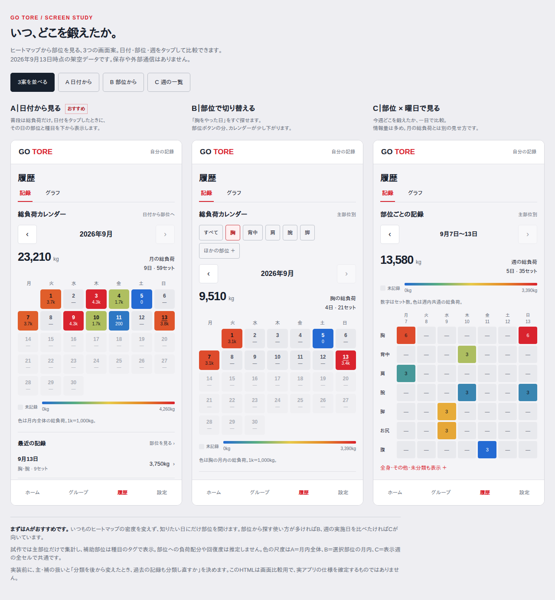

# ヒートマップと部位の画面比較（#136）

2026-09-13のユーザー依頼による試作。3案を比較してから採用する。**本番機能・集計仕様は未採用**。元となる現行仕様は[総負荷ヒートマップ](activity-heatmap.md)と[種目の部位分類](exercise-body-parts.md)。

[操作できるHTML](previews/heatmap-body-parts.html) / [比較画像](images/heatmap-body-parts/comparison.png) / [個別画像](images/heatmap-body-parts/README.md)

## 3案

| 案 | 操作 | 向いている確認 | 表示量と注意点 |
| --- | --- | --- | --- |
| A: 日付から見る（推奨） | カレンダーの日付 → 部位内訳 → 種目 | この日にどこを鍛えたか | 通常のカレンダーに部位のボタンを増やさない。別の日を見るときは詳細を閉じる |
| B: 部位で切り替える | 部位を選ぶ → 月の実施日を見る → 日の詳細 | 胸を最後にやったのはいつか | 部位ボタンの分だけ縦に長い。補助としての腕は腕の集計に含めない仮案 |
| C: 部位×曜日で見る | 週を選ぶ → 部位のマス → 日の種目 | 週にどの部位を何セット記録したか | 7部位×7日で情報が多い。全身・その他・未分類は展開。普段の月表示とは別の表示 |

推奨はA単独からの採用。複数案をまとめて入れると操作と表示が増えるため、B/Cは利用後に必要性を見て判断する。



## 試作で置いた仮定

- 全案で同じ架空データを使用。実績があるのは2026年8月末〜9月13日。前月・前週への切り替えも試せる。試作の日付上限は9月13日で固定する。
- 主部位に種目全体の総負荷（重量×回数×セット数）を1度だけ計上。補助部位は種目名の下に表示する。実際の筋肉への負荷配分を意味しない。
- 自重は0kgのまま青で表示し、未記録の灰色と区別する。9月5日の胸、9月11日の腹で比較できる。分類のない種目は未分類に残す。
- 色は現行の青→緑→黄→オレンジ→赤と同じ補間を使う。紫は使わない。部位固有の色や、健康・回復・部位間の優劣判定は追加しない。
- Aの色尺度は月内全体、Bは選択した主部位の月内、Cは表示週の全セルで共通。Cの数字はセット数。各画面に凡例を表示する。色の尺度が異なる期間・部位の色だけを直接比較しない。
- 日の内訳は主部位にまとめ、行をタップすると種目が絞られる。「すべて見る」でその日の全種目へ戻れる。
- 種目の編集・削除・記録の保存は行わない。上部の「グラフ」と下部ナビは配置を比較する表示見本。日付・部位・月/週・詳細の開閉・比較案の切り替えが動く。

## 操作方法

HTMLは外部ライブラリ・フォント・API・DBを使用しない。ブラウザでファイルを直接開ける。

```bash
python3 -m http.server 8765 --bind 127.0.0.1 --directory docs/previews
```

起動した端末のブラウザで `http://localhost:8765/heatmap-body-parts.html` を開く。停止はCtrl+C。

- 通常表示: 3案を並べ、上部ボタンで1案に絞れる。小さい画面では縦に並ぶ。
- `?view=a` / `?view=b` / `?view=c`: 1案の表示。
- `?view=a&capture=1`: 比較用の説明を外し、画面幅いっぱいに試作画面を表示する。
- A: 9月13日 → 胸/腕の行 → 種目一覧。
- B: 胸/腕を切り替える → 「ほかの部位」から未分類・全身も確認。
- C: マスをタップ。前週に切り替えると8月31日を含む週を表示。

## 実アプリへ接続する前に決めること

1. A/B/Cの採用案。今回の比較後にユーザーが選ぶ。
2. 主部位のみの集計でよいか。種目選択は現在、主部位・補助部位の両方で検索するため、集計表示とは意味が異なる。
3. 現行データは本人の種目リストに分類があり、過去の記録に部位のスナップショットを保存していない。分類の後編集・候補の削除・旧記録をどう扱うか決める。友達の記録を閲覧者の分類で勝手に集計しない。

採用後は既存の月・日別キャッシュと先読みへ部位内訳を含める方針で設計する。部位の切り替えごとに全履歴を再取得する構成は避ける。現時点では通信・DBの実装や実データの速度計測はしていない。

## 検証

ローカルChromiumで3案それぞれの320/390/430px、詳細の開閉、Escapeとフォーカス復帰、部位切り替え、月・週の境界、未来日無効、0kg/未記録/未分類、主補の重複計上なしを確認。JavaScriptエラーと外部HTTPリクエストは0件。

文書と静的な画面見本のため、実アプリのテストは追加・再実行していない。サーバーへの保存・実機の操作感・アクセシビリティ全体の監査は未検証。試作から本番への接続時は、確定した集計・権限・訂正後の再計算をテストする。
