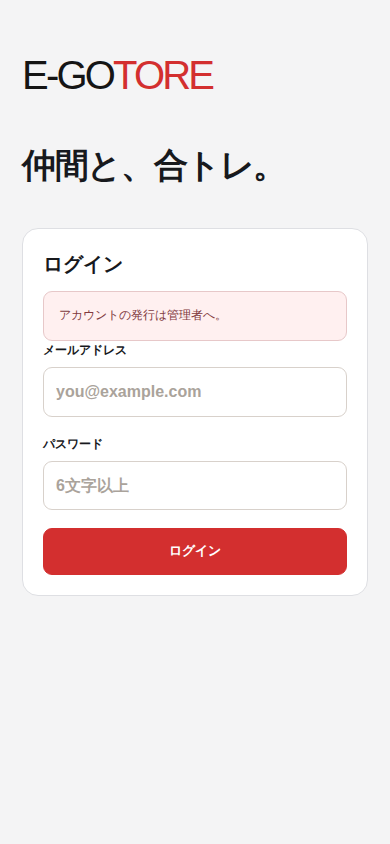
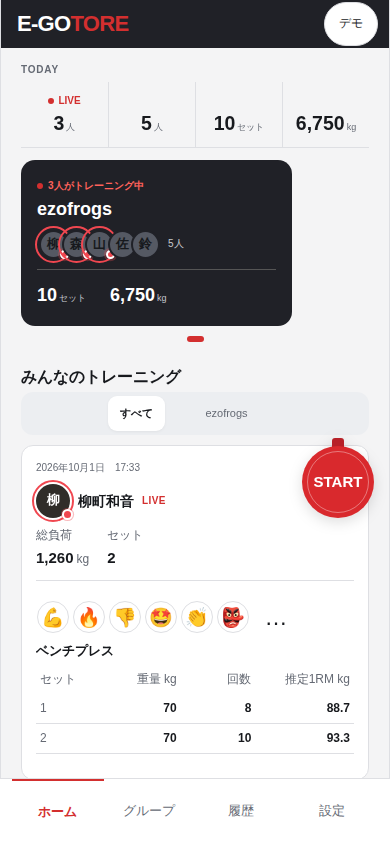
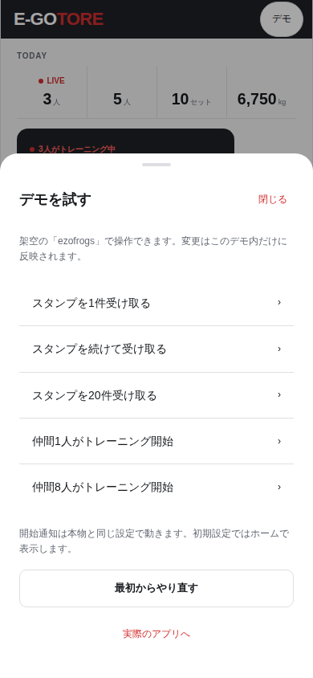
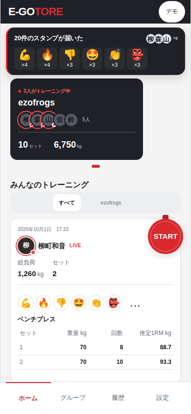
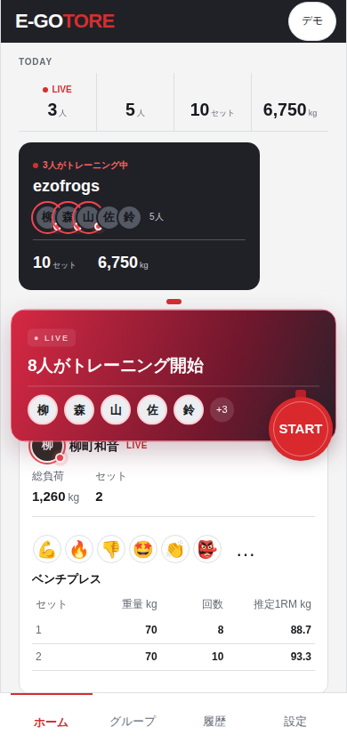
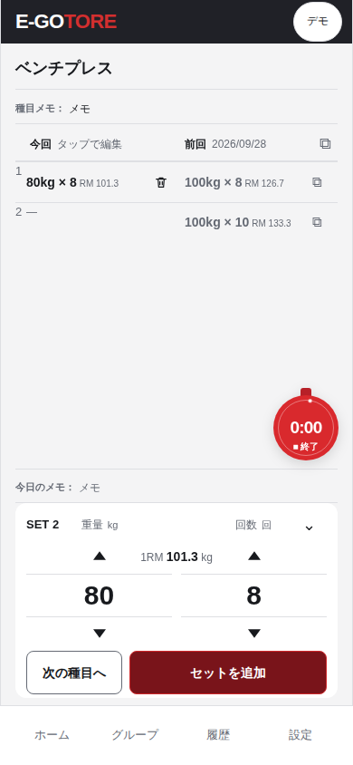
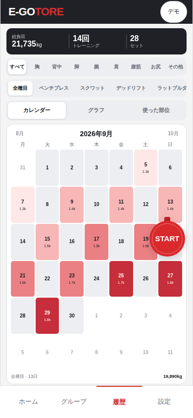
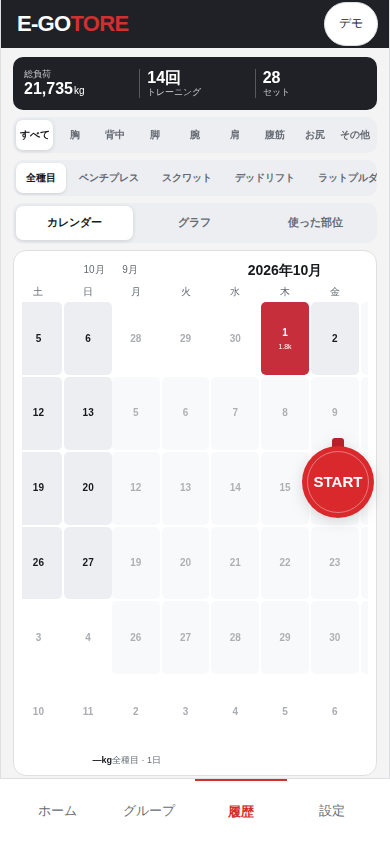

# ログイン不要デモの実画面

390×844 CSS px、Chromium、ライトテーマ。2026-10-01、通知/リング時計を統合した実アプリから撮影。API/DBへ接続せずデモの架空データを利用し、描画後に撮影。実ユーザーのアカウント/記録/通知を利用しない。

| 変更前: 通常の `/` はログインが必要 | 変更後: `/demo` でそのまま操作 |
| --- | --- |
|  |  |

これは同じ画面の装飾変更ではなく、ログイン不要の入口を追加した比較。`/` のログイン仕様は変わらない。

開いている間はスタンプと開始通知を自動受信する。手動でも再生できる。開始画像は最新の中央カットインへ更新。

追加したデモ操作と、既存部品による通知・記録:

| デモメニュー | 20件のスタンプ | 8人の開始 | セット記録 |
| --- | --- | --- | --- |
|  |  |  |  |

[採用仕様](../../design/demo.md)。320/390/430pxの操作・横幅はE2Eで検証。OS通知や閉じた後の通知はデモに含まない。

## 2026-10-02: 現行カレンダーへの同期

390×844 CSS px・Chromium・ライト。日付を2026-10-02へ固定した架空データの/demoを撮影。個人/グループ両方で月別データ・指への追従・日付詳細を検証した。

| 月送り後（9月） | 指で隣月へ移動中 |
| --- | --- |
|  |  |

時計は現行のSTART・細いリングを表示し、通常画面と共通の部品を使用する。
