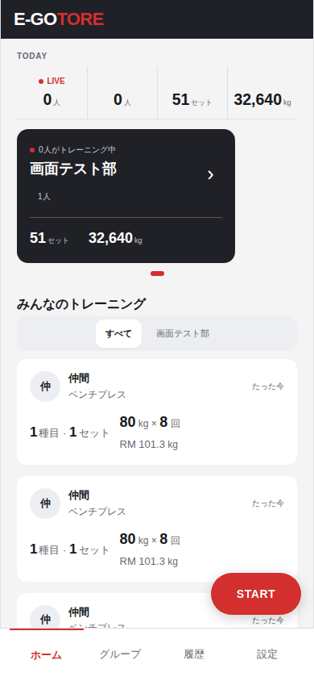

# Issue #197 当日50件超の集計表示

2026-09-27、Chromium 390×844px。ホームの当日フィードは50件、各件は1セット・640kg。APIの集計値は51件分（51セット・32,640kg）として修正前後を同じ応答で比較した。

| 修正前 | 修正後 |
| --- | --- |
|  |  |

専用DBの統合テストでは0・1・50・51件、複数グループ共有、訂正、共有解除、削除、退出を確認する。画像は画面の表示値の代表例。
