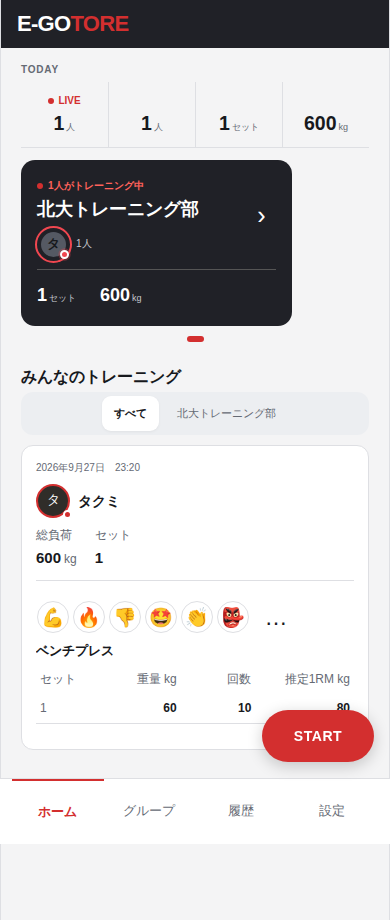
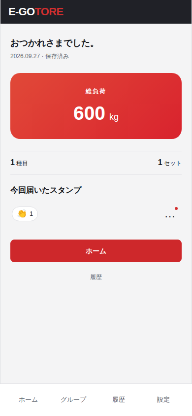

# Issue #199 スタンプE2Eの現行画面

2026-09-27、Chromium 390×844px、ローカルAuth・DBで作った2人の実記録。今回の変更はE2Eの期待値と活動APIモックの更新で、アプリの画面実装は変更していない。

| ホームの送信側 | トレーニング終了後の受信側 |
| --- | --- |
|  |  |

修正前のテストは、すでに撤去された「保存しました」、スタンプ追加の `＋`、記録中の受信欄を探していた。修正後のE2Eは、保存済み記録をAPIで確認し、常設された `👏スタンプ` を押す。記録中の未読はAPIで、終了後の表示と既読操作は画面で確認する。受信欄を記録中に表示するかはIssue #205の調査対象。
