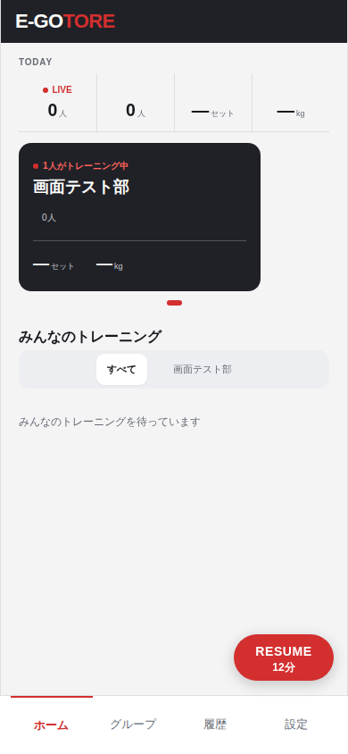
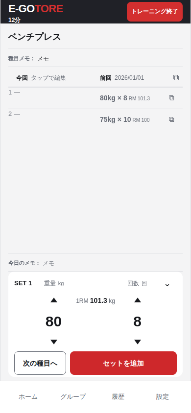

# 進行中の経過時間（Issue #202）

390×844 CSS pxのローカルChromium画面。架空のトレーニングを開始から12分経過した状態で表示した。

| ホームのRESUME | 記録入力 |
| --- | --- |
|  |  |

両画面の経過時間は同じ`started_at`を基準にする。画面の幅・高さはブラウザE2Eで320/390/430pxを確認した。実機PWAでの表示・スリープ復帰は別途確認する。
