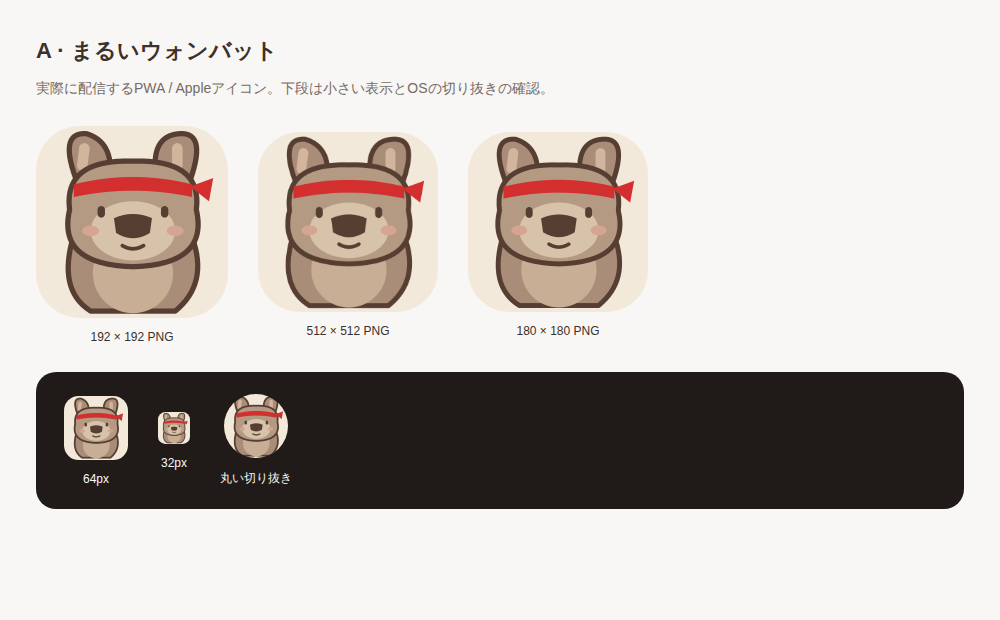

# 起動キャラクターとアプリアイコンの比較（#146）

2026-09-14の追加依頼で、筋トレアニメーションはアプリを開いた最初の読み込みだけに絞る。ウォンバットを優先しつつ、現在のハムスターと別の動物も比較してから選ぶ。同じキャラクターをPWA/Appleのアプリアイコンにする。

## 採用: A・まるいウォンバット

2026-09-14、ユーザーがA案を選択。赤いハチマキ、大きな鼻、丸い体のウォンバットを起動アニメーションとアプリアイコンに採用する。以下の比較は選択の経緯として保持する。

[実装後の起動画面・配信アイコン](images/wombat/README.md)

## 比較した4案

| 案 | キャラクター | 表情・形 | アイコン |
| --- | --- | --- | --- |
| A・おすすめ | まるいウォンバット | ぽってりした体、大きな鼻、丸い口元 | 親しみやすい顔とハチマキ |
| B | すっきりウォンバット | 線・色を絞った四角めの体と顔 | 小さくても輪郭が残る形 |
| C | 現在のハムスター | PR #147の顔と動きをそのまま保持 | 同じ顔をアイコンへ展開 |
| D | ラッコ | 明るい口元、ひげ、長いしっぽ | 動物の違いが分かる顔としっぽ |

[動く比較ページ](previews/mascot-options.html)で4案を並べ、選んだ案を起動画面と64px/32pxのアイコンで確認できる。動きの停止・再開、明暗の切替も可能。ボタンは試作表示を切り替えるだけで、採用や設定保存はしない。

## 採用仕様

- 起動時の認証状態確認中だけアニメーションを出す。履歴・グループ・分析・再試行では短い状態文にし、取得済みの内容を隠さない。
- SVG/CSSを使い、起動を長く見せる待機や動画の取得を追加しない。動き低減では静止画。
- 起動キャラクターと192/512pxのPWAアイコン・180pxのAppleアイコンをA案の同じ顔で統一する。アイコンは薄いベージュの不透明背景とし、OSが角を切り抜く前の正方形を配信する。
- 顔・体・色のSVG部品を共通化して起動時とアイコンでずれないようにする。PWA/ブラウザの参照URLに版を付け、旧ダンベル画像と区別する。

今回の比較は既存SVGの形・色を展開したもので、ダウンロードする動画や画像生成サービスへの依存は増やさない。アイコンの角丸は比較用で、実装時はOSの切り抜きと安全領域を確認する。
